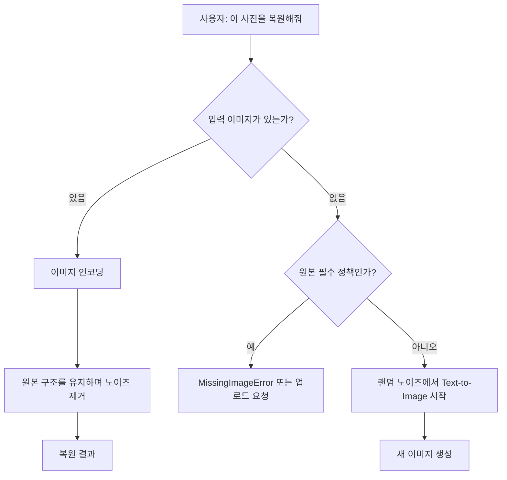
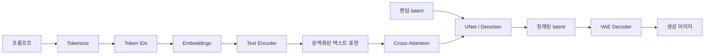
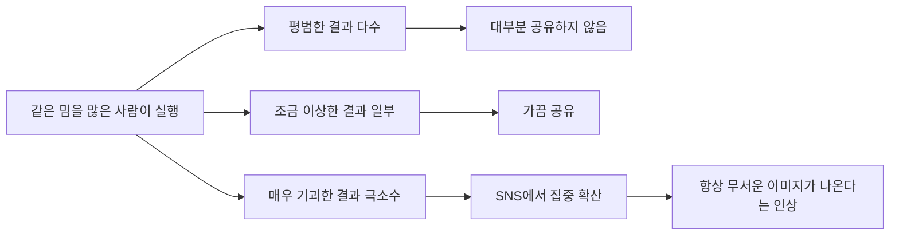

이거 보고 궁금해서 해봄

참고로 이런 이미지가 나왔다. (안된다고 하는데 그냥 한번 해보라고 함.)
다른 사람들은 귀신사진과 같은 기괴한 이미지가 나온다고 하니 찾아보시길..

---

## 배경

인터넷에는 AI에게 첨부하지도 않은 사진을 “복원해달라”고 했더니 정체불명의 인물이나 일그러진 얼굴이 나왔다는 이야기가 종종 올라온다. 특히 프롬프트에 “사진 내용에 대해 사과한다”, “아주 이상하다”, “질문하지 말고 눈을 감고 복원해라” 같은 문장이 섞이면 괴담처럼 보이는 결과가 공유되곤 한다.

하지만 AI가 존재하지 않는 사진을 보거나 숨겨진 이미지를 복원한 것은 아니다. 핵심은 훨씬 단순하다.

> 입력 이미지가 없는데도 시스템이 요청을 거절하지 않으면, 복원이 아니라 텍스트를 조건으로 한 새 이미지 생성이 시작될 수 있다.

이 글에서는 이 현상을 개발자 관점에서 토큰화, 임베딩, 텍스트 인코더, Cross-Attention, 확산 모델, UNet, VAE, 랜덤 시드까지 이어지는 파이프라인으로 풀어본다.

---

## 결과 먼저 보기

요청을 처리하는 애플리케이션을 아주 단순화하면 다음과 같다.

```python
def handle_restore_request(prompt, uploaded_image=None):
    if uploaded_image is not None:
        return restore_image(uploaded_image, prompt)

    if REQUIRE_SOURCE_IMAGE:
        raise MissingImageError("복원할 원본 이미지가 없습니다.")

    # 느슨한 구현: 복원 대신 일반 생성으로 폴백
    return text_to_image(prompt, seed=random_seed())
```

> 위 코드는 특정 제품의 실제 소스가 아니라 동작 차이를 설명하기 위한 교육용 의사코드다. 실제 서비스의 모델 구성, 프롬프트 재작성, 안전장치는 서로 다르다.

즉 결과는 크게 두 갈래다.



무서운 이미지가 나오는 경우는 마지막 분기다. 시스템은 사진을 복구한 것이 아니라 프롬프트 분위기에 어울리는 이미지를 새로 합성했다.

---

## 이미지 복원과 Text-to-Image는 출발점이 다르다

이미지 복원(Image-to-Image)은 원본 사진에서 출발한다. 원본을 잠재 공간(latent space)으로 인코딩하고, 적은 양의 노이즈를 섞은 뒤 손상이나 흐림을 줄이는 방향으로 다시 생성한다.

```python
# 교육용 의사코드
source_latent = vae.encode(damaged_image)
noisy_latent = add_noise(source_latent, strength=0.2)

restored_latent = denoise(
    latent=noisy_latent,
    condition=text_encoder("restore this damaged photo")
)

restored_image = vae.decode(restored_latent)
```

반면 Text-to-Image는 원본 구조가 없다. 시작점은 랜덤 노이즈다.

```python
# 교육용 의사코드
latent = random_noise(seed=482917)
condition = text_encoder(prompt)
generated_latent = denoise(latent, condition)
generated_image = vae.decode(generated_latent)
```

두 코드가 비슷해 보여도 첫 줄이 결정적으로 다르다.

| 작업 | 시작점 | 보존할 원본 | 결과의 의미 |
|---|---|---|---|
| 이미지 복원 | 원본을 인코딩한 latent | 있음 | 원본을 바탕으로 보정한 이미지 |
| Text-to-Image | 랜덤 노이즈 | 없음 | 프롬프트로 새로 합성한 이미지 |

원본이 없으면 모델이 지켜야 할 얼굴, 구도, 장소가 없다. 따라서 결과에 낯선 가족사진이나 정체불명의 인물이 등장해도 그것은 “발견”이 아니라 생성이다.

---

## 프롬프트는 어떻게 이미지 조건이 되는가

전체 흐름을 단순화하면 다음과 같다.



### 1. Tokenization: 문장을 모델이 다룰 단위로 자르기

모델은 문장을 그대로 읽지 않는다. 먼저 토크나이저가 문자열을 토큰으로 나누고 각 토큰을 정수 ID로 바꾼다.

```python
# 개념 예시. 실제 분할과 ID는 모델마다 다르다.
tokens = tokenizer.tokenize("restore this strange photo")
# ["restore", "this", "strange", "photo"]

token_ids = tokenizer.convert_tokens_to_ids(tokens)
# [1042, 589, 7310, 2201]
```

한글도 반드시 단어 하나가 토큰 하나가 되는 것은 아니다. 모델과 토크나이저에 따라 조사나 음절 일부가 별도 토큰으로 나뉠 수 있다.

### 2. Embeddings: 토큰 ID를 벡터로 바꾸기

정수 ID 자체에는 연속적인 의미가 없다. 임베딩 레이어는 각 ID를 고차원 벡터로 바꾼다.

```python
# shape 예시: [batch, sequence_length, hidden_size]
token_vectors = embedding_table(token_ids)
```

학습 과정에서 비슷한 문맥에 등장하는 표현은 모델이 활용하기 쉬운 표현 공간에 배치된다. 다만 `strange_vector + photo_vector = horror_vector`처럼 사람이 읽을 수 있는 축이 정확히 하나씩 존재한다고 생각하면 안 된다. 의미는 많은 차원과 레이어에 분산돼 표현된다.

### 3. Text Encoder: 문맥을 반영한 표현 만들기

`photo`라는 토큰도 `family photo`, `damaged photo`, `strange photo`에서 의미가 달라진다. Transformer 기반 텍스트 인코더는 Self-Attention으로 주변 토큰의 관계를 반영한다.

```python
text_condition = text_encoder(token_vectors)
```

그래서 모델이 받는 조건은 단어별 사전 뜻의 단순한 합이 아니라, 문장 전체 문맥이 섞인 벡터 표현이다.

---

## Cross-Attention: 텍스트와 이미지 특징을 연결하기

노이즈를 제거하는 네트워크는 매 단계에서 텍스트 조건을 참고한다. 전통적인 Latent Diffusion 계열을 기준으로 설명하면, 이미지 latent의 특징이 Query가 되고 텍스트 표현이 Key와 Value가 된다.

```python
# 교육용으로 단순화한 형태
Q = image_features @ W_q
K = text_condition @ W_k
V = text_condition @ W_v

weights = softmax((Q @ K.T) / sqrt(head_dim))
attended_text = weights @ V
```

수식으로는 흔히 다음처럼 쓴다.

```text
Attention(Q, K, V) = softmax(QK^T / sqrt(d_k))V
```

이 연결 덕분에 이미지의 서로 다른 공간적 특징이 `photo`, `damaged`, `eyes closed`, `strange` 같은 텍스트 조건을 서로 다른 강도로 참고할 수 있다. “특정 픽셀이 특정 단어를 읽는다”는 표현은 이해를 돕는 비유이며, 실제 계산은 여러 해상도·헤드·레이어에 분산된다.

---

## Diffusion과 UNet: 노이즈를 이미지 구조로 바꾸기

확산 모델은 학습할 때 이미지에 노이즈를 점점 추가하는 과정을 배우고, 생성할 때는 그 반대 방향으로 노이즈를 제거한다. 많은 고전적 Latent Diffusion 구현에서는 UNet이 현재 latent, timestep, 텍스트 조건을 받아 제거할 노이즈를 예측한다.

```python
# 교육용 의사코드
latent = randn(shape, generator=seed)

for timestep in scheduler.timesteps:
    predicted_noise = unet(
        latent=latent,
        timestep=timestep,
        encoder_hidden_states=text_condition,
    )
    latent = scheduler.step(predicted_noise, timestep, latent)
```

초기 단계에서는 큰 구도와 덩어리가, 후반 단계에서는 질감과 세부 묘사가 구체화되는 경향이 있다. 단, 모든 최신 이미지 모델이 정확히 같은 UNet 구조를 사용하는 것은 아니다. Diffusion Transformer 등 다른 denoiser 구조도 있으므로 여기서는 이해하기 쉬운 대표 구조로 설명한다.

### VAE는 무엇을 하는가

고해상도 픽셀 전체에서 직접 확산을 수행하면 계산량이 크다. Latent Diffusion에서는 VAE(Variational Autoencoder)가 이미지를 더 작은 latent 표현으로 압축하고 다시 픽셀로 복원한다.

```python
latent = vae.encode(image)     # 픽셀 → 압축 표현
image = vae.decode(latent)     # 압축 표현 → 픽셀
```

Text-to-Image에서는 denoiser가 latent를 정제하고, 마지막에 VAE decoder가 이를 우리가 볼 수 있는 이미지로 바꾼다. VAE는 원본이 없던 장면을 기억에서 꺼내는 장치가 아니다.

---

## 왜 하필 무서운 결과가 나오는가

### 1. 프롬프트의 의미가 공포 사진 문맥과 겹친다

다음 표현을 한 문장에 넣었다고 해보자.

- 사진 내용에 대해 사과한다
- 아주 이상하다
- 설명을 받아들이지 마라
- 눈을 감고 복원하라
- 스스로 만들어라

사람은 이것을 AI를 시험하는 장난스러운 지시로 이해할 수 있다. 그러나 생성 파이프라인에서는 `strange`, `sorry`, `eyes closed`, `damaged photo`에 해당하는 문맥이 오래된 사진, 어두운 분위기, 눈을 감은 인물, 불명확한 얼굴 같은 시각 패턴과 연결될 수 있다.

프롬프트를 이미지 생성에 맞게 자동 재작성하는 서비스라면 이 분위기가 더 명시적인 장면 묘사로 바뀔 수도 있다. 정확한 재작성 방식은 제품마다 다르며 공개되지 않은 경우도 많다.

### 2. “복원” 자체가 오래된 사진의 사전확률을 높인다

`restore photo`라는 표현은 학습 데이터에서 현대의 선명한 풍경보다 오래된 흑백 가족사진, 손상된 필름, 흐릿한 인물사진과 자주 함께 나타났을 가능성이 높다. 원본이 없으면 모델은 이런 통계적 경향에 기대어 장면을 구성한다.

```text
restore
  └─ old / damaged photo
       ├─ vintage texture
       ├─ faded portrait
       └─ family photograph
```

### 3. 얼굴의 작은 오류는 유난히 크게 느껴진다

사람은 얼굴의 눈, 입, 대칭에 매우 민감하다. 풍경의 창문 하나가 조금 틀어진 것은 지나치기 쉽지만, 눈동자 위치나 치아 개수가 어긋나면 즉시 이상함을 느낀다.

```text
거의 정상적인 얼굴
+ 미세한 비대칭
+ 흐릿한 눈과 입
+ 오래된 필름 질감
= 불쾌한 골짜기
```

따라서 평범한 생성 오류가 “의도적으로 무섭게 만든 이미지”처럼 해석되기 쉽다.

---

## 랜덤 시드가 결과를 바꾼다

같은 프롬프트라도 초기 노이즈가 달라지면 결과가 달라진다. 이 초기 상태를 재현할 때 사용하는 값이 랜덤 시드다.

```python
# 같은 prompt, 다른 seed
image_a = generate(prompt, seed=1)
image_b = generate(prompt, seed=2)
image_c = generate(prompt, seed=3)
```

시드는 “공포 정도”를 저장한 번호가 아니다. 의사난수 생성기의 출발점을 고정해 같은 초기 latent를 재현하게 하는 값이다. 모델 버전, sampler, step 수, 해상도, 프롬프트 재작성 등 다른 조건도 같아야 동일 결과를 기대할 수 있다.

그래서 한 번은 평범한 가족사진이 나오고, 다음에는 얼굴이 흐릿한 인물이 나올 수 있다. 한 장의 특이한 출력만으로 모델의 일반적인 행동을 판단하기 어려운 이유다.

---

## 인터넷에서는 왜 항상 무서운 것처럼 보일까?

여기에는 선택 편향, 특히 생존자 편향이 크게 작용한다.



평범한 결과는 이야기거리가 되지 않는다. 반면 눈이 이상하거나 정체불명의 인물이 나온 한 장은 “AI가 없는 사진에서 무언가를 봤다”는 설명과 함께 빠르게 퍼진다. 우리가 보는 표본은 전체 생성 결과가 아니라 공유할 가치가 있다고 선택된 극단값에 가깝다.

모델의 세대나 유료·무료 여부만으로 현상을 설명하는 것도 부족하다. 결과에는 다음 요소가 함께 영향을 준다.

- 사용한 이미지 모델과 체크포인트
- 공포 스타일 LoRA나 파인튜닝 적용 여부
- 서비스의 프롬프트 재작성과 안전 정책
- 입력 프롬프트의 언어와 문맥
- 랜덤 시드, sampler, step 수, guidance 설정
- 사용자가 여러 결과 중 무엇을 골라 공유했는지

---

## 구현할 때는 복원과 생성을 명시적으로 분리하자

제품 코드에서는 사용자의 동사를 보고 작업 유형을 추측하기보다 입력 계약을 명확히 하는 편이 안전하다.

```ts
type RestoreRequest = {
  mode: 'restore'
  sourceImage: Blob
  prompt?: string
}

type GenerateRequest = {
  mode: 'generate'
  prompt: string
  seed?: number
}

function validateRequest(request: RestoreRequest | GenerateRequest) {
  if (request.mode === 'restore' && !request.sourceImage) {
    throw new Error('SOURCE_IMAGE_REQUIRED')
  }
}
```

백엔드에서도 폴백을 숨기지 않는 것이 좋다.

```python
def run_job(job):
    if job.mode == "restore":
        if job.source_image is None:
            raise MissingImageError()
        return image_to_image(job.source_image, job.prompt)

    if job.mode == "generate":
        return text_to_image(job.prompt, job.seed)

    raise UnsupportedModeError(job.mode)
```

이렇게 하면 “복원” 요청이 조용히 “생성”으로 바뀌어 사용자가 결과의 출처를 오해하는 일을 막을 수 있다. 교육용 데모를 만든다면 출력 옆에 `원본 기반 복원`과 `프롬프트 기반 생성`을 명확히 표시해야 한다.

---

## 오해하기 쉬운 표현 정리

| 흔한 설명 | 더 정확한 설명 |
|---|---|
| AI가 없는 사진을 복원했다 | 원본 없이 프롬프트를 조건으로 새 이미지를 생성했다 |
| 단어 하나가 공포 벡터를 켰다 | 문장 전체의 분산 표현이 여러 레이어에서 이미지 생성 조건으로 작용했다 |
| 픽셀이 특정 단어를 읽었다 | 이미지 특징과 텍스트 특징이 Cross-Attention으로 연결됐다 |
| UNet이 그림을 기억해 꺼냈다 | denoiser가 학습된 분포와 조건을 바탕으로 노이즈 제거 방향을 예측했다 |
| 시드가 무서운 이미지를 담고 있다 | 시드는 초기 의사난수 상태를 재현한다 |
| 무서운 결과가 많이 보이니 항상 그렇게 나온다 | 특이한 결과만 선택적으로 공유됐을 가능성이 크다 |

---

## 정리

사진이 없는 복원 요청에서 기괴한 이미지가 나오는 과정은 초자연적이지 않다.

```text
입력 이미지 없음
→ 시스템이 생성 모드로 폴백
→ 프롬프트를 토큰화하고 문맥 벡터로 인코딩
→ Cross-Attention으로 텍스트 조건을 denoiser에 전달
→ 랜덤 latent에서 반복적으로 노이즈 제거
→ VAE가 latent를 픽셀 이미지로 디코딩
→ 프롬프트의 불길한 의미와 얼굴 생성 오류가 결합
→ 극단적으로 무서운 결과만 SNS에서 선택적으로 확산
```

핵심은 두 가지다.

1. 원본이 없으면 복원이 아니다. 결과가 만들어졌다면 대부분 새로운 이미지 생성이다.
2. 모델의 출력과 인터넷에서 관찰하는 출력은 다르다. 랜덤성과 선택 편향을 함께 봐야 한다.

AI가 보이지 않는 무언가를 본 것이 아니라, 텍스트 조건과 학습된 이미지 분포를 바탕으로 가장 그럴듯한 픽셀을 합성했고 사람이 그중 가장 기괴한 결과에 이야기를 붙인 것이다.
